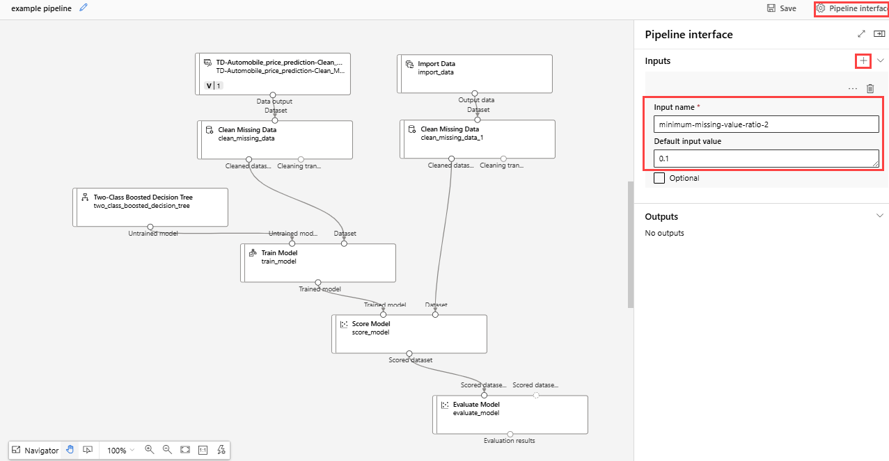
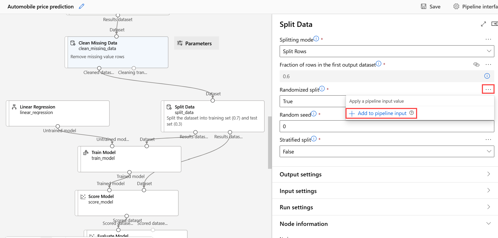
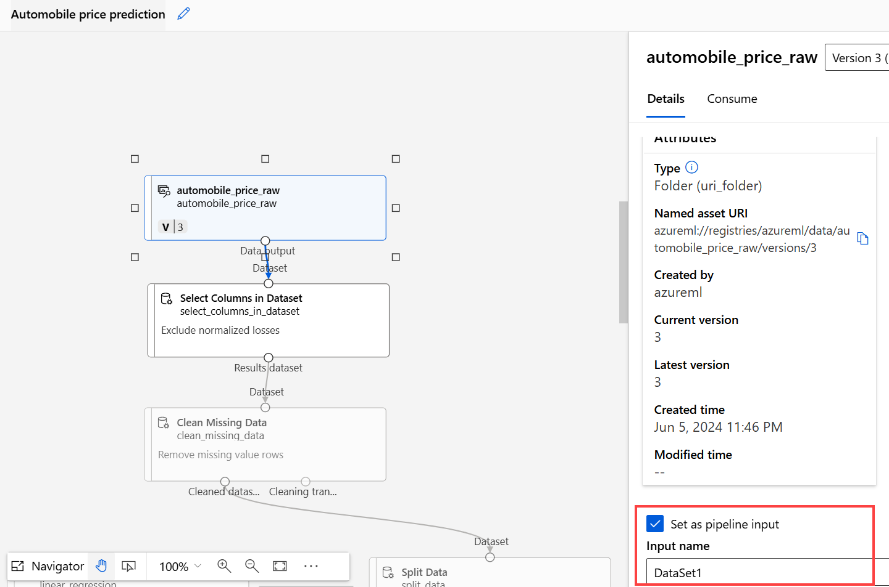
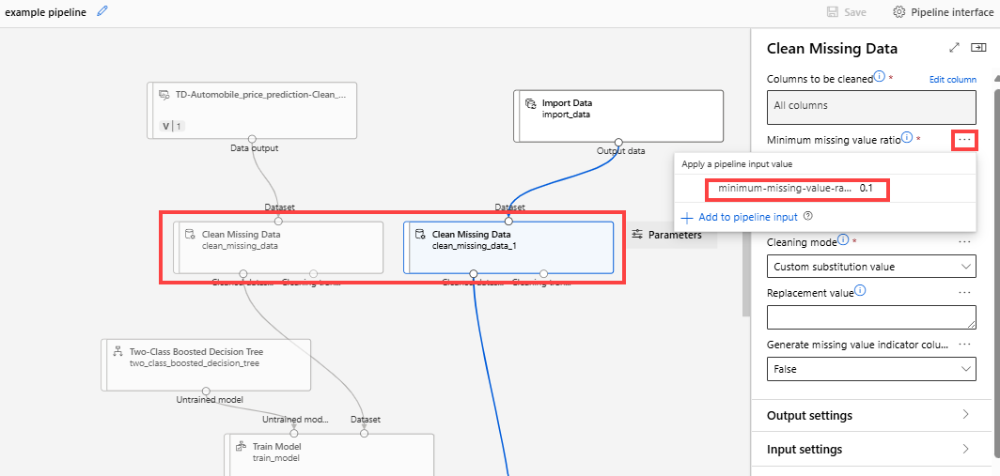
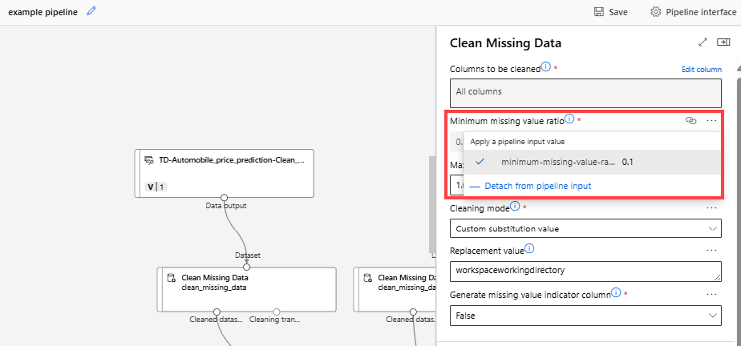
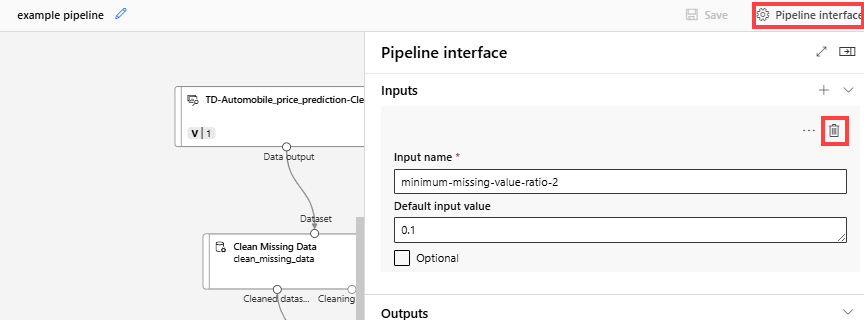
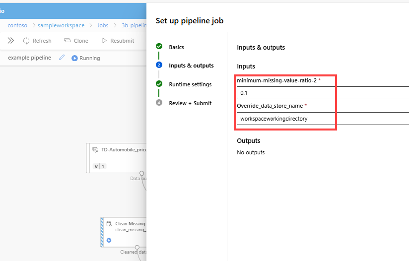

# Use pipeline parameters in the designer to build versatile pipelines

[!INCLUDE [v1 deprecation](../includes/sdk-v1-deprecation.md)]

Use pipeline parameters to build flexible pipelines in the designer. Pipeline parameters let you dynamically set values at runtime to encapsulate pipeline logic and reuse assets.

Pipeline parameters are especially useful when resubmitting a pipeline job, [retraining models](how-to-retrain-designer.md), or [performing batch predictions](how-to-run-batch-predictions-designer.md).

In this article, you learn how to do the following:

> [!div class="checklist"]
> * Create pipeline parameters
> * Delete and manage pipeline parameters
> * Trigger pipeline jobs while adjusting pipeline parameters

## Prerequisites

* An Azure Machine Learning workspace. See [Create workspace resources](../quickstart-create-resources.md).

* For a guided introduction to the designer, complete the [designer tutorial](tutorial-designer-automobile-price-train-score.md). 

> [!IMPORTANT]
> If you do not see graphical elements mentioned in this document, such as buttons in studio or designer, you may not have the right level of permissions to the workspace. Please contact your Azure subscription administrator to verify that you have been granted the correct level of access. For more information, see [Manage users and roles](../how-to-assign-roles.md).

## Create pipeline parameter

There are three ways to create a pipeline parameter in the designer:
- Create a pipeline parameter in the settings panel, and bind it to a component.
- Promote a component parameter to a pipeline parameter.
- Promote a dataset to a pipeline parameter

> [!NOTE]
> Pipeline parameters only support basic data types like `int`, `float`, and `string`.

### Option 1: Create a pipeline parameter in the settings panel

In this section, you create a pipeline parameter in the settings panel.

In this example, you create a pipeline parameter that defines how a pipeline fills in missing data using the **Clean missing data** component.

1. Next to the name of your pipeline draft, select the **gear icon** to open the **Settings** panel.

1. In the **Pipeline parameters** section, select the **+** icon.

1.  Enter a name for the parameter and a default value. 

    For example, enter `replace-missing-value` as parameter name and `0` as default value.

   

After you create a pipeline parameter, you must [attach it to the component parameter](#attach-component-parameter-to-pipeline-parameter) that you want to dynamically set.

### Option 2: Promote a component parameter

The simplest way to create a pipeline parameter for a component value is to promote a component parameter. Use the following steps to promote a component parameter to a pipeline parameter:

1. Select the component you want to attach a pipeline parameter to.
1. In the component detail pane, mouseover the parameter you want to specify.
1. Select the ellipses (**...**) that appear.
1. Select **Add to pipeline parameter**.

    

1. Enter a parameter name and default value.
1. Select **Save**

You can now specify new values for this parameter anytime you submit this pipeline.

### Option 3: Promote a dataset to a pipeline parameter

If you want to submit your pipeline with variable datasets, you must promote your dataset to a pipeline parameter:

1. Select the dataset you want to turn into a pipeline parameter.

1. In the detail panel of dataset, check **Set as pipeline parameter**.

   

You can now specify a different dataset by using the pipeline parameter the next time you run the pipeline.

## Attach and detach component parameter to pipeline parameter 

In this section, you will learn how to attach and detach component parameter to pipeline parameter.

### Attach component parameter to pipeline parameter

You can attach the same component parameters of duplicated components to the same pipeline parameter if you want to alter the value at one time when triggering the pipeline job.

The following example has duplicated **Clean Missing Data** component. For each **Clean Missing Data** component, attach **Replacement value** to pipeline parameter **replace-missing-value**:

1. Select the **Clean Missing Data** component.

1. In the component detail pane, to the right of the canvas, set the **Cleaning mode** to "Custom substitution value".

1. Mouseover the **Replacement value** field.

1. Select the ellipses (**...**) that appear.

1. Select the pipeline parameter `replace-missing-value`.

   

You have successfully attached the **Replacement value** field to your pipeline parameter. 

### Detach component parameter to pipeline parameter

After you attach **Replacement value** to pipeline parameter, it is non-actionable.

You can detach component parameter to pipeline parameter by clicking the ellipses (**...**) next to the component parameter, and select **Detach from pipeline parameter**.

 

## Update and delete pipeline parameters

In this section, you learn how to update and delete pipeline parameters.

### Update pipeline parameters

Use the following steps to update a component pipeline parameter:

1. At the top of the canvas, select the gear icon.
1. In the **Pipeline parameters** section, you can view and update the name and default value for all of your pipeline parameter.

### Delete a dataset pipeline parameter

Use the following steps to delete a dataset pipeline parameter:

1. Select the dataset component.
1. Uncheck the option **Set as pipeline parameter**.

### Delete component pipeline parameters

Use the following steps to delete a component pipeline parameter:

1. At the top of the canvas, select the gear icon.

1. Select the ellipses (**...**) next to the pipeline parameter.

    This view shows you which components the pipeline parameter is attached to.

    

1. Select **Delete parameter** to delete the pipeline parameter.

    > [!NOTE]
    > Deleting a pipeline parameter will cause all attached component parameters to be detached and the value of detached component parameters will keep current pipeline parameter value.     

## Trigger a pipeline job with pipeline parameters 

In this section, you learn how to submit a pipeline job while setting pipeline parameters.

### Resubmit a pipeline job

After submitting a pipeline with pipeline parameters, you can resubmit a pipeline job with different parameters:

1. Go to pipeline detail page. In the **Pipeline job overview** window, you can check current pipeline parameters and values.

1. Select **Resubmit**.
1. In the **Setup pipeline job**, specify your new pipeline parameters. 

### Use published pipelines

You can also publish a pipeline to use its pipeline parameters. A **published pipeline** is a pipeline that has been deployed to a compute resource, which client applications can invoke via a REST endpoint.

Published endpoints are especially useful for retraining and batch prediction scenarios. For more information, see [How to retrain models in the designer](how-to-retrain-designer.md) or [Run batch predictions in the designer](how-to-run-batch-predictions-designer.md).

## Next steps

In this article, you learned how to create pipeline parameters in the designer. Next, see how you can use pipeline parameters to [retrain models](how-to-retrain-designer.md) or perform [batch predictions](how-to-run-batch-predictions-designer.md).

You can also learn how to [use pipelines programmatically with the SDK v1](how-to-deploy-pipelines.md?view=azureml-api-1&preserve-view=true).
