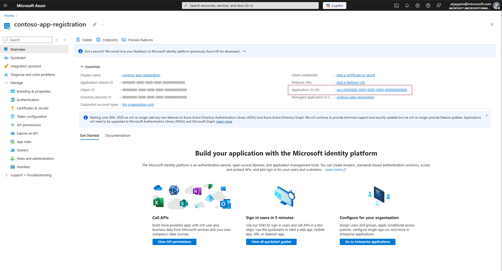
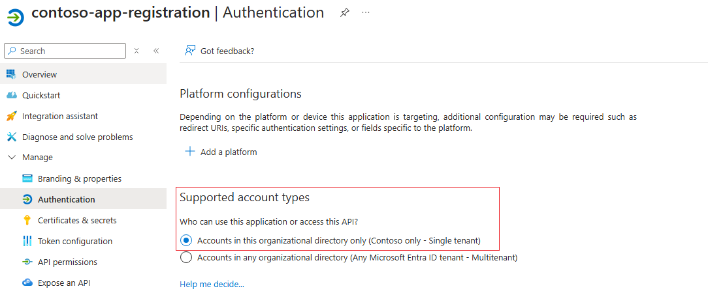
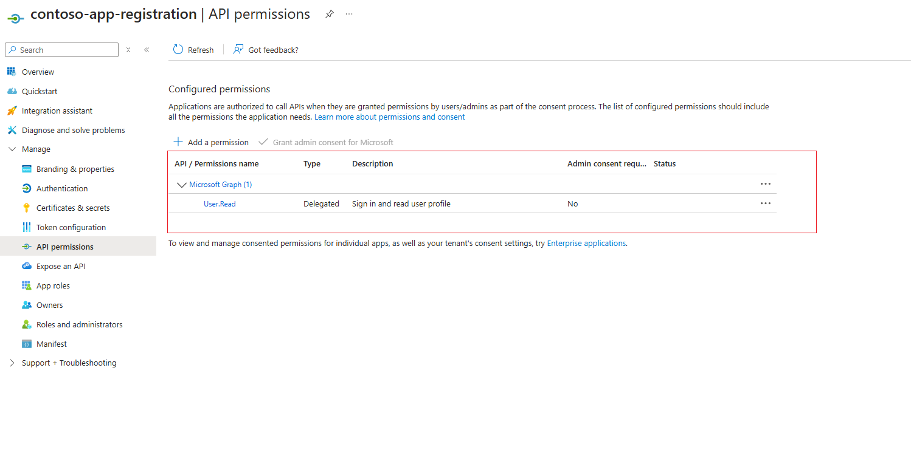
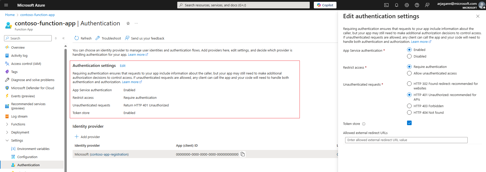
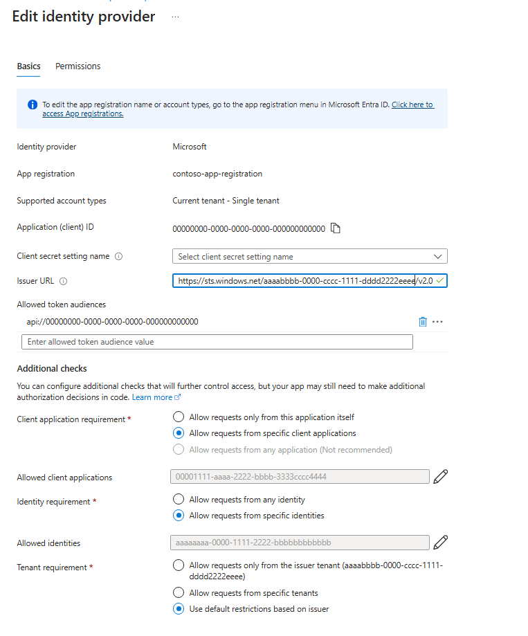

# Authenticate to Azure Function App using "Easy Auth" (Azure AI Search)

This article explains how to set up an indexer connection to an Azure Function app using the [built-in authentication capabilities of App services](/azure/app-service/overview-authentication-authorization), also known as "Easy Auth". Azure Function apps are a great solution for hosting Custom Web APIs that an Azure AI Search service can use either to enrich content ingested during an indexer run, or to vectorize content in a search query if you're using a custom embedding model for [integrated vectorization](vector-search-integrated-vectorization.md).

You can use either a system-assigned or a user-assigned identity of the search service to authenticate against the Azure Function app. This approach requires setting up a Microsoft Entra ID application registration to use as the authentication provider for the Azure Function app, as explained in this article.

## Prerequisites

* [Create a managed identity](search-howto-managed-identities-data-sources.md) for your search service.

## Configure Microsoft Entra ID application to use as authentication provider

To use Microsoft Entra ID as an authentication provider to the Azure Function app, an application registration must be created. There are 2 options to do so - either creating one automatically via the Azure Function app itself, or using an already created existing application. To learn more about these steps follow [Azure App services' documentation](/azure/app-service/configure-authentication-provider-aad?tabs=workforce-configuration#choose-the-app-registration.md).

Regardless of either option, ensure that the app registration is configured per the following steps to ensure it being compatible with Azure AI Search.

### Ensure the app registration has application ID URI configured

The app registration should be configured with an application ID URI, which can then be used as the token audience with Azure Function apps and Azure AI Search. Configure it in the format `api://<applicationId>`. This can be done by navigating to the **Overview** section of the app registration and setting the **Application ID URI** field.

[  ](./media/search-howto-managed-identities-azure-functions/app-registration-overview.png#lightbox)

### Set supported account types for authentication

Navigate to the **Authentication** section of the app registration and configure the **supported account types** so that only accounts in the same organization directory as the app registration can utilize it for authentication.

[  ](./media/search-howto-managed-identities-azure-functions/authentication-supported-account.png#lightbox)

### (Optional) Configure a client secret

App services recommend utilizing a client secret for the authentication provider application. Authentication still works without client secret, as long as the delegated permissions are set up. To set up a client secret, navigate to the **Certificates & secrets** section of the app registration, and add a **New client secret** as explained [in this article](/entra/identity-platform/quickstart-register-app?tabs=client-secret#add-credentials).

[  ](./media/search-howto-managed-identities-azure-functions/client-secret.png#lightbox)

### Add a scope to delegate permissions

Navigate to the section **Expose an API** and configure the app registration to have a scope that delegates admin and user permissions to it, to ensure that it's compatible with the indexer's authentication flow.

[  ](./media/search-howto-managed-identities-azure-functions/expose-api-user-impersonation.png#lightbox)

Once the delegated permissions scope is set up, you should notice in the **API permissions** section of the app registration that the **User.Read** API on Microsoft.Graph is set.

[  ](./media/search-howto-managed-identities-azure-functions/api-permissions.png#lightbox)

## Configure Microsoft Entra ID authentication provider in Azure Function app

With the client application registered with the exact specifications above, Microsoft Entra ID authentication for the Azure Function app can be set up by following the [guide from App Services](/azure/app-service/configure-authentication-provider-aad). Navigate to the **Authentication** section of the Azure Function app to set up the authentication details.

Ensure the following settings are configured to ensure that Azure AI Search can successfully authenticate to the Azure Function app.

### Configure authentication settings

* Ensure that **App Service authentication** is **Enabled**
* Restrict access to the Azure Function app to **Require authentication**
* For **Unauthenticated requests** prefer **HTTP 401: Unauthorized**

The following screenshot highlights these specific settings for a sample Azure Function app.

[  ](./media/search-howto-managed-identities-azure-functions/function-app-authentication.png#lightbox)

### Add Microsoft Entra ID authentication provider

* Add Microsoft Entra ID as the authentication provider for the Azure Function app.
* Either create a new app registration or choose a previously configured app registration. Ensure that it's configured according to the guidelines in the previous section of this document.
* Ensure that in the **Allowed token audiences** section, the application ID URI of the app registration is specified. It should be in the `api://<applicationId>` format, matching what was configured with the app registration created earlier.
* If you desire, you can configure additional checks to restrict access specifically to the indexer. 

[  ](./media/search-howto-managed-identities-azure-functions/identity-provider.png#lightbox)

### Configure additional checks

* Ensure that the **Object (principal) ID** of the specific Azure AI Search service's identity is specified as the **Identity requirement**, by checking the option **Allow requests from specific identities** and entering the **Object (principal) ID** in the identity section.

[  ](./media/search-howto-managed-identities-azure-functions/search-service-identity.png#lightbox)

* In **Client application requirement** select the option **Allow requests from specific client application**. You need to look up the Client ID for the Azure AI Search service's identity. To do this, copy over the Object (principal) ID from the previous step and look up in your Microsoft Entra ID tenant. There should be a matching enterprise application whose overview page lists an **Application ID**, which is the GUID that needs to be specified as the client application requirement.

[  ](./media/search-howto-managed-identities-azure-functions/search-identity-entra.png#lightbox)


>[!NOTE]
> This step is the most important configuration on the Azure Function app and doing it wrongly can result in the indexer being forbidden from accessing the Azure Function app. Ensure that you perform the lookup of the identity's enterprise application details correctly, and you specify the **Application ID** and **Object (principal) ID** in the right places.

* For the **Tenant requirement**, choose any of the options that aligns with your security posture. Check out the [Azure App service documentation](/azure/app-service/configure-authentication-provider-aad) for more details.

## Setting up a connection to the Azure Function app

Depending on whether the connection to the Azure Function app needs to be made in a Custom Web API skill or a Custom Web API vectorizer, the JSON definition is slightly different. In both cases, ensure that you specify the correct URI to the Azure Function app and set the `authResourceId` to be the same value as the **Allowed token audience** configured for the authentication provider. 

Depending on whether you choose to connect using a system assigned identity or a user assigned identity, details required will be slightly different. 

### Using system assigned identity
Here's an example to call into a function named `test` for the sample Azure Function app, where the system assigned identity of the search service is allowed to authenticate via "Easy Auth".

```json
"uri": "https://contoso-function-app.azurewebsites.net/api/test?",
"authResourceId": "api://00000000-0000-0000-0000-000000000000"
```

### Using user assigned identity

Here's an example to call into the same function, where the specific user assigned identity is allowed to authenticate via "Easy Auth". You're expected to specify the resource ID of the exact user assigned identity to use in the `identity` property of the configuration.

```json
"uri": "https://contoso-function-app.azurewebsites.net/api/test?",
"authResourceId": "api://00000000-0000-0000-0000-000000000000",
"identity" : { 
        "@odata.type": "#Microsoft.Azure.Search.DataUserAssignedIdentity",
        "userAssignedIdentity": "/subscriptions/[subscription-id]/resourcegroups/[rg-name]/providers/Microsoft.ManagedIdentity/userAssignedIdentities/[my-user-managed-identity-name]" 
    }
```

>[!NOTE]
> This user assigned identity should actually be assigned to the Azure AI Search service for it to be specified in the Custom Web skill/vectorizer definition.

## Run the indexer/vectorizer to verify permissions

For Custom Web API skills, permissions are validated during indexer run-time. For vectorizer, they're validated when a vector query is issued utilizing the Custom Web API vectorizer. To rule out any specific issues with authentication, you can test by disabling the authentication provider on the Azure Function app and ensuring that calls from indexer/vectorizer succeed.

* If authentication issues persist, ensure that the right identity information - namely Application ID, Object (principal) ID for the Azure AI Search service's identity is specified in the Azure Function app's authentication provider.

## See also

* [Custom Web API skill](cognitive-search-custom-skill-web-api.md)
* [Custom Web API vectorizer](vector-search-vectorizer-custom-web-api.md)
